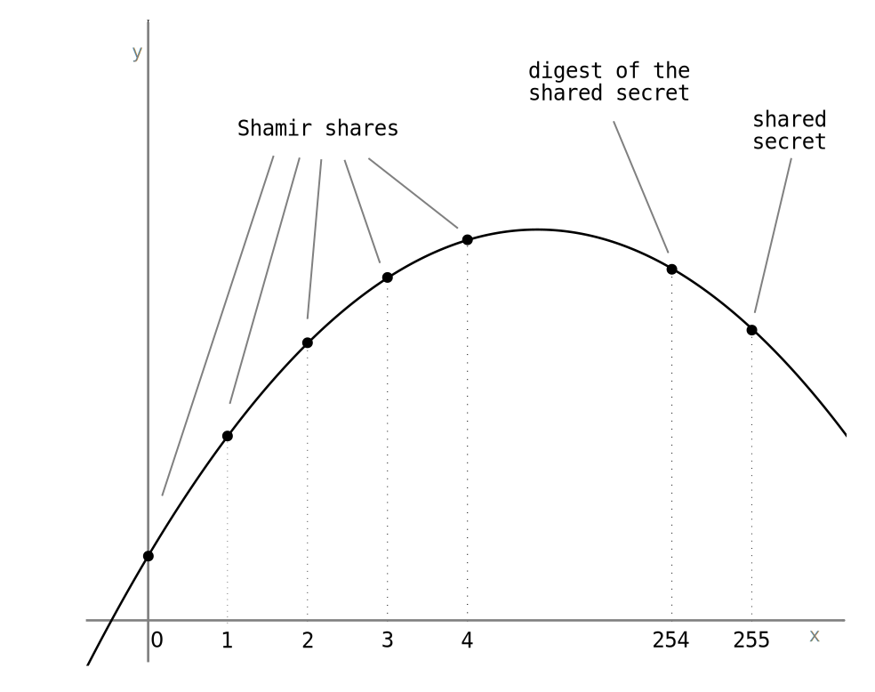

# SLIP-0039 : Shamir's Secret-Sharing for Mnemonic Codes

```
Number:  SLIP-0039
Title:   Shamir's Secret-Sharing for Mnemonic Codes
Type:    Standard
Status:  Final
Authors: Pavol Rusnak <stick@satoshilabs.com>
         Andrew Kozlik <andrew.kozlik@satoshilabs.com>
         Ondrej Vejpustek <ondrej.vejpustek@satoshilabs.com>
         Tomas Susanka <tomas.susanka@satoshilabs.com>
         Marek Palatinus <slush@satoshilabs.com>
         Jochen Hoenicke <hoenicke@gmail.com>
Created: 2017-12-18
```

## Table of contents

* [Abstract](#abstract)
* [Notation](#notation)
* [Motivation](#motivation)
* [Shamir's secret-sharing](#shamirs-secret-sharing)
* [Two level scheme](#two-level-scheme)
* [Format of the share mnemonic](#format-of-the-share-mnemonic)
* [Generating and combining the shares](#generating-and-combining-the-shares)
  * [Polynomial interpolation](#polynomial-interpolation)
  * [Sharing a secret](#sharing-a-secret)
  * [Generating the shares](#generating-the-shares)
  * [Combining the shares](#combining-the-shares)
* [Checksum](#checksum)
* [Passphrase](#passphrase)
* [Encryption of the master secret](#encryption-of-the-master-secret)
* [Decryption of the master secret](#decryption-of-the-master-secret)
* [Versioning](#versioning)
* [Localization](#localization)
* [Wordlist](#wordlist)
* [Specification for backing up BIP-0032 Hierarchical Deterministic Wallets](#specification-for-backing-up-bip-0032-hierarchical-deterministic-wallets)
* [Test vectors](#test-vectors)
* [Reference implementation](#reference-implementation)
* [Design rationale](#design-rationale)
* [References](#references)

## Abstract

This SLIP describes a standard and interoperable implementation of Shamir's secret-sharing (SSS) and a specification for its use in backing up Hierarchical Deterministic Wallets described in [BIP-0032](https://github.com/bitcoin/bips/blob/master/bip-0032.mediawiki). SSS splits a master secret into unique parts which can be distributed among participants. A specified minimum number of parts is required to be supplied in order to reconstruct the original secret. Knowledge of fewer than the required number of parts does not leak information about the master secret. This SLIP is mainly intended as a replacement for [BIP-0039](https://github.com/bitcoin/bips/blob/master/bip-0039.mediawiki) and for the most part the two are [not compatible](#Bip39Compatibility).

## Notation

Notation        | Meaning
----------------|---------------------------------------------------------------
*G*             | total number of groups, a positive integer, 1 &le; *G* &le; 16
*N<sub>i</sub>* | total number of members in group *i*, a positive integer, 1 &le; *N<sub>i</sub>* &le; 16
*GT*            | group threshold, a positive integer, 1 &le; *GT* &le; *G*
*T<sub>i</sub>* | member threshold for group *i*, a positive integer, 1 &le; *T<sub>i</sub>* &le; *N<sub>i</sub>*
*id*            | random identifier, a 15-bit positive integer
*MS*            | master secret, a string
*n*             | length of the master secret in bytes
*EMS*           | encrypted master secret, a string
&#124;&#124;    | concatenation operator
xor             | bit-wise exclusive-or of two strings

## Motivation

Preservation of digital assets is generally important and it is especially important in the case of decentralized payments systems such as Bitcoin, where there is no recourse in the case of loss of an asset. The usual approach to protecting digital assets is redundant backups, but when the asset itself is of significant and liquidable value, there is a substantial risk of the backup holder absconding with the asset. Shamir's secret-sharing provides a better mechanism for backing up secrets by distributing custodianship among a number of trusted parties in a manner that can prevent loss even if one or a few of those parties become compromised.

However, the lack of SSS standardization to date presents a risk of being unable to perform secret recovery in the future should the tooling change. Therefore, we propose standardizing SSS so that SLIP-0039 compatible implementations will be interoperable.

## Shamir's secret-sharing

Shamir's secret-sharing (SSS) is a cryptographic mechanism describing how to split a secret into *N* unique parts, where any *T* of them are required to reconstruct the secret. First, a polynomial *f* of degree *T* &minus; 1 is constructed and each party is given a corresponding point - an integer input *x* to the polynomial and the corresponding output *f*(*x*).

When any *T* points are provided, they exactly define the polynomial. Usually the value of the polynomial *f*(0) is used as the shared secret. In this specification the shared secret is stored as *f*(255)<sup>[3](#IndexEncoding)</sup>. More details on SSS can be found on [Wikipedia](https://en.wikipedia.org/wiki/Shamir%27s_Secret_Sharing).

We propose that given a secret, *T* &minus; 2 shares be generated randomly and the remaining shares be computed in such a way that *f*(255) encodes the shared secret and *f*(254) encodes the digest<sup>[4](#Digest)</sup> of the shared secret. Encoding the digest makes it possible to verify that the shared secret has been correctly recovered. The diagram below illustrates the splitting of a secret into five shares such that any three are required to recover the shared secret (*N* = 5 and *T* = 3).



Shamir's secret sharing scheme is applied separately to each byte of the shared secret and GF(256) is used as the underlying finite field<sup>[1](#FiniteField)</sup>. Bytes are interpreted as elements of GF(256) using polynomial representation with operations modulo the Rijndael irreducible polynomial *x*<sup>8</sup> + *x*<sup>4</sup> + *x*<sup>3</sup> + *x* + 1, see [AES](https://doi.org/10.6028/NIST.FIPS.197) sections 3.2, 4.1 and 4.4.

## Two level scheme

One characteristic of Shamir’s secret sharing scheme is that all shares are equal. Thus if the owner of the secret needs to distribute the amount of trust unevenly between shareholders, then some shareholders need to be given multiple shares. Furthermore, as discussed by [Allen and Friedenbach](https://github.com/WebOfTrustInfo/rwot8-barcelona/blob/master/topics-and-advance-readings/social-key-recovery.md), the owner might want to restrict the combinations of shareholders which are able to reconstruct the secret, because some combinations of shareholders might be more likely to collude against the owner than others. To facilitate this we propose that the encrypted master secret (*EMS*) is first split using a *GT*-of-*G* scheme to obtain a set of first-level shares, aka *group shares*. The *i*-th group share, 1 &le; *i* &le; *G*, is then split using a *T<sub>i</sub>*-of-*N<sub>i</sub>* scheme to obtain a set of second-level shares, aka *member shares*, which are distributed among the shareholders. Two levels are assumed to be sufficient to accommodate the majority of use cases while maintaining a comprehensive user interface.

For example, Alice wants to be able to reconstruct her *EMS* on her own using her 2 shares, which she has stored at different locations. In case these shares get destroyed, she also wants to have a backup with her friends and family in such a way that 3 of her 5 friends together with 2 of her 6 family members are required to reconstruct the *EMS*. A two level secret sharing scheme can easily accommodate such requirements. In the given example Alice first splits the *EMS* using a 2-of-4 scheme to obtain the group shares A, B, C and D. She keeps A and B for herself and splits C further using a 3-of-5 scheme to obtain member shares C1, ... , C5, giving one to each friend. Similarly, Alice splits D among her family members using a 2-of-6 scheme. Thus family members receive a greater amount of trust than friends, without having to give one person multiple shares. However, even if all six family members collude against Alice, they cannot obtain the *EMS* without the help of at least three of Alice's friends or without stealing one of Alice's own shares.

All shares created in accordance with this specification use the two level secret sharing scheme. If the creator of the shares wishes to use only a basic single-level *T*-of-*N* scheme, then they SHOULD<sup>[2](#GroupPolicies)</sup> create a single group and conduct the splitting at the second level, i.e. *GT* = 1, *G* = 1, *T*<sub>1</sub> = *T* and *N*<sub>1</sub> = *N*.

If the member threshold *T<sub>i</sub>* of a group is 1, then the size *N<sub>i</sub>* of the group SHOULD<sup>[2](#GroupPolicies)</sup> also be equal to 1. The one share can then be given to multiple members.

## Format of the share mnemonic

We propose the following format of the shares:

| Identifier (*id*) | Iteration exponent (*e*) | Group index (*GI*) | Group threshold (*Gt*) | Group count (*g*) | Member index (*I*) | Member threshold (*t*) | Padded share value (*ps*) | Checksum (*C*) |
|---------|--------|--------|--------|--------|--------|--------|---------------------|---------|
| 15 bits | 5 bits | 4 bits | 4 bits | 4 bits | 4 bits | 4 bits | padding + 8*n* bits | 30 bits |

* The **identifier** (*id*) field is a random 15-bit value which is the same for all shares and is used to verify that the shares belong together; it is also used as salt in the encryption of the master secret.
* The **iteration exponent** (*e*) field indicates the total number of iterations to be used in PBKDF2. The number of iterations is calculated as 10000&times;2<sup>*e*</sup>.
* The **group index** (*GI*) field<sup>[3](#IndexEncoding)</sup> is the *x* value of the group share.
* The **group threshold** (*Gt*) field<sup>[3](#IndexEncoding)</sup> indicates how many group shares are needed to reconstruct the master secret. The actual value is encoded as *Gt* = *GT* &minus; 1, so a value of 0 indicates that a single group share is needed (*GT* = 1), a value of 1 indicates that two group shares are needed (*GT* = 2) etc.
* The **group count** (*g*) indicates the total number of groups. The actual value is encoded as *g* = *G* &minus; 1.
* The **member index** (*I*) field<sup>[3](#IndexEncoding)</sup> is the *x* value of the member share in the given group.
* The **member threshold** (*t*) field<sup>[3](#IndexEncoding)</sup> indicates how many member shares are needed to reconstruct the group share. The actual value is encoded as *t* = *T* &minus; 1.
* The **padded share value** (*ps*) field corresponds to a list of the SSS part's *f<sub>k</sub>*(*x*) values (see the diagram above), 1 &le; *k* &le; *n*. Each *f<sub>k</sub>*(*x*) value is encoded as a string of eight bits in big-endian order. The concatenation of these bit strings is the share value. This value is left-padded with "0" bits so that the length of the padded share value in bits becomes the nearest multiple of 10.
* The **checksum** (*C*) field is an RS1024 checksum (see [below](#checksum)) of the data part of the share (that is *id* || *e* || *GI* || *Gt* || *g* || *I* || *t* || *ps*). The customization string (*cs*) of RS1024 is "shamir".

This structure is then converted into a mnemonic code by splitting it up into 10-bit segments with each becoming an index into a word list containing exactly 1024 words (see [below](#wordlist)). Big-endian bit order is used in all conversions. The entropy<sup>[4](#Digest)</sup> of the master secret MUST be at least 128 bits and its length MUST be a multiple of 16 bits. All implementations MUST support master secrets of length 128 bits and 256 bits:

| Security | Padded share value length | Total share length  |
|----------|---------------------------|---------------------|
| 128 bits | 130 bits                  | 200 bits = 20 words |
| 256 bits | 260 bits                  | 330 bits = 33 words |

This construction yields a beneficial property where the random identifier and the iteration exponent transform into the first two words of the mnemonic code, so the user can immediately tell whether the correct shares are being combined, i.e. they have to have the same first two words. Moreover, the third word encodes the group index, group threshold and part of the group count. Since the group threshold and group count are constant, all shares belonging to the same group start with the same three words.

## Generating and combining the shares

### Polynomial interpolation

Given a set of *m* points (*x<sub>i</sub>*, *y<sub>i</sub>*), 1 &le; *i* &le; *m*, such that no two *x<sub>i</sub>* values equal, there exists a polynomial that assumes the value *y<sub>i</sub>* at each point *x<sub>i</sub>*. The polynomial of lowest degree that satisfies these conditions is uniquely determined and can be obtained using the Lagrange interpolation formula given below.

Since Shamir's secret sharing scheme is applied separately to each of the *n* bytes of the shared secret, we work with *y*<sub>*i*</sub> as a vector of *n* values, where *y*<sub>*i*</sub>[*k*] = *f<sub>k</sub>*(*x<sub>i</sub>*), 1 &le; *k* &le; *n*, and *f<sub>k</sub>* is the polynomial in the *k*-th instance of the scheme.

#### Interpolate(*x*, {(*x<sub>i</sub>*, *y*<sub>*i*</sub>), 1 &le; *i* &le; *m*})

**Input:** the desired index *x*, a set of index/value-vector pairs {(*x<sub>i</sub>*, *y*<sub>*i*</sub>), 1 &le; *i* &le; *m*} &subseteq; GF(256) &times; GF(256)<sup>*n*</sup>

**Output:** the value-vector (*f*<sub>1</sub>(*x*), ... , *f<sub>n</sub>*(*x*))

![f_k(x) = \sum_{i=1}^m y_i[k] \prod_{\underset{j \neq i}{j=1}}^m \frac{x - x_j}{x_i - x_j}](slip-0039/lagrange.png)

### Sharing a secret

#### SplitSecret(*T*, *N*, *S*)

**Input:** threshold *T*, number of shares *N*, secret *S*

**Output:** shares *y*<sub>1</sub>, ... , *y<sub>N</sub>* for share indices 0, ... , *N* &minus; 1

1. Check the following conditions:
   * 0 &lt; *T* &le; *N* &le; 16
   * The length of *S* in bits is at least 128 and a multiple of 16.

   If any of these conditions is not satisfied, then abort.
2. If *T* is 1, then let *y<sub>i</sub>* = *S* for all *i*, 1 &le; *i* &le; *N*, and return.
3. Let *n* be the length of *S* in bytes. Generate *R* &in; GF(256)<sup>*n*&minus;4</sup> randomly with uniform distribution and let *D* be the concatenation of the first 4 bytes of HMAC-SHA256(key=*R*, msg=*S*) with the *n* &minus; 4 bytes of *R*.
4. Let *y*<sub>1</sub>, ... , *y*<sub>*T*&minus;2</sub> &in; GF(256)<sup>*n*</sup> be generated randomly, independently with uniform distribution.
5. For *i* such that *T* &minus; 2 &lt; *i* &le; *N* compute *y<sub>i</sub>* = Interpolation(*i* &minus; 1, {(0, *y*<sub>1</sub>), ... , (*T* &minus; 3, *y*<sub>*T*&minus;2</sub>), (254, *D*), (255, *S*)}).

The source of randomness used to generate the values in steps 3 and 4 above MUST be suitable for generating cryptographic keys.

#### RecoverSecret(*T*, [(*x*<sub>1</sub>, *y*<sub>1</sub>), ... , (*x<sub>m</sub>*, *y<sub>m</sub>*)])

**Input:** threshold *T*, a list of *m* share-index/share-value pairs [(*x*<sub>1</sub>, *y*<sub>1</sub>), ... , (*x<sub>m</sub>*, *y<sub>m</sub>*)]

**Output:** the shared secret *S*

1. If *T* is 1, then let *S* = *y*<sub>1</sub> and return.
2. Compute *S* = Interpolation(255, [(*x*<sub>1</sub>, *y*<sub>1</sub>), ... , (*x<sub>m</sub>*, *y<sub>m</sub>*)]).
4. Compute *D* = Interpolation(254, [(*x*<sub>1</sub>, *y*<sub>1</sub>), ... , (*x<sub>m</sub>*, *y<sub>m</sub>*)]).
5. Let *R* be the last *n* &minus; 4 bytes of *D*. If the first 4 bytes of HMAC-SHA256(key=*R*, msg=*S*) are equal to the first 4 bytes of *D*, then return *S*, otherwise abort.

### Generating the shares

#### GenerateShares(*GT*, [(*T*<sub>1</sub>,*N*<sub>1</sub>), ... , (*T<sub>G</sub>*,*N<sub>G</sub>*)], *MS*, *P*, *e*)

**Input:** group threshold *GT*, list of member thresholds *T*<sub>1</sub>, ... , *T<sub>G</sub>* and group sizes *N*<sub>1</sub>, ... , *N<sub>G</sub>*, master secret *MS*, passphrase *P*, iteration exponent *e*

**Output:** list of shares

1. If *T<sub>i</sub>* = 1 and *N<sub>i</sub>* &gt; 1 for any *i*, then abort.
2. Generate a random 15-bit value *id*.
3. Compute the encrypted master secret *EMS* = Encrypt(*MS*, *P*, *e*, *id*).
4. Compute the group shares *s*<sub>1</sub>, ... , *s<sub>G</sub>* = SplitSecret(*GT*, *G*, *EMS*).
5. For each group share *s<sub>i</sub>*, 1 &le; *i* &le; *G*, compute the member shares *s*<sub>*i*,1</sub>, ... , *s*<sub>*i*,*N<sub>i</sub>*</sub> = SplitSecret(*T<sub>i</sub>*, *N<sub>i</sub>*, *s<sub>i</sub>*).
6. For each *i* and each *j*, 1 &le; *i* &le; *G*, 1 &le; *j* &le; *N<sub>i</sub>*, return (*id*, *e*, *i* &minus; 1, *GT* &minus; 1, *j* &minus; 1, *T<sub>i</sub>* &minus; 1, *s<sub>i,j</sub>*).

### Combining the shares

**Input:** list of shares, passphrase *P*

**Output:** master secret *MS*

1. Check the following conditions:
   * The checksum of each share MUST be valid. Implementations SHOULD NOT implement correction beyond potentially suggesting to the user where in the mnemonic an error might be found, without suggesting the correction to make<sup>[5](#ChecksumDesign)</sup>.
   * All shares MUST have the same identifier *id*, iteration exponent *e*, group threshold *GT*, group count *G* and length. The value of *G* MUST be greater than or equal to *GT*.
   * Let *GM* be the number of pairwise distinct group indices among the given shares. Then *GM* MUST be equal to *GT*.
   * All shares with a given group index *GI<sub>i</sub>*, 1 &le; *i* &le; *GM*, MUST have the same member threshold *T<sub>i</sub>*, their member indices MUST be pairwise distinct and their count *M<sub>i</sub>* MUST be equal to *T<sub>i</sub>*.
   * The length of the padding of the share value in bits, which is equal to the length of the padded share value in bits modulo 16, MUST NOT exceed 8 bits.
   * All padding bits MUST be "0".
   * The length of each share value MUST be at least 128 bits.

   Abort if any check fails.

2. Let *s<sub>i</sub>* = RecoverSecret([(*I*<sub>*i*,1</sub>, *s*<sub>*i*,1</sub>), ... , (*I*<sub>*i*,*M<sub>i</sub>*</sub>, *s*<sub>*i*,*M<sub>i</sub>*</sub>)]), where *I<sub>i,j</sub>* and *s<sub>i,j</sub>* are the member-index/share-value pairs of the shares with group index *GI<sub>i</sub>*.

3. Let *EMS* = RecoverSecret([(*GI*<sub>1</sub>, *s*<sub>1</sub>), ... , (*GI<sub>GM</sub>*, *s<sub>GM</sub>*)])

4. Return *MS* = Decrypt(*EMS*, *P*, *e*, *id*).

## Checksum

The last three words of the mnemonic form a checksum and contain no information. Valid mnemonics MUST pass the criteria for validity specified by the Python3 code snippet below. The function `rs1024_verify_checksum` must return true when its arguments are:

- `cs`: the customization string
- `data`: the data part as a list of 10-bit integers, each corresponding to one word of the mnemonic

```
def rs1024_polymod(values):
  GEN = [0xe0e040, 0x1c1c080, 0x3838100, 0x7070200, 0xe0e0009, 0x1c0c2412, 0x38086c24, 0x3090fc48, 0x21b1f890, 0x3f3f120]
  chk = 1
  for v in values:
    b = (chk >> 20)
    chk = (chk & 0xfffff) << 10 ^ v
    for i in range(10):
      chk ^= GEN[i] if ((b >> i) & 1) else 0
  return chk

def rs1024_verify_checksum(cs, data):
  return rs1024_polymod([ord(x) for x in cs] + data) == 1
```

This implements a Reed-Solomon code over GF(1024) that guarantees detection of any error affecting at most 3 words and has less than a 1 in 10<sup>9</sup> chance of failing to detect more errors. More details about the properties can be found in the Checksum Design appendix<sup>[5](#ChecksumDesign)</sup>. The customization string is processed by feeding each character's US-ASCII value into the checksum calculation prior to the data.

To construct a valid checksum given the customization string and the values of the data-part words, the code below can be used:

```
def rs1024_create_checksum(cs, data):
  values = [ord(x) for x in cs] + data
  polymod = rs1024_polymod(values + [0,0,0]) ^ 1
  return [(polymod >> 10 * (2 - i)) & 1023 for i in range(3)]
```

## Passphrase

To allow additional protection, the master secret is encrypted with a passphrase using the encryption function described below. There is no way to verify that the correct passphrase was used to decrypt the encrypted master secret. This allows the user to obtain multiple master secrets from a single encrypted master secret by using different passphrases<sup>[8](#PassphraseVerification)</sup>.

In order to achieve the best interoperability among various operating systems and wallet implementations, the passphrase MUST be a string containing only printable ASCII characters (code points 32-126). If no passphrase is provided, an empty string SHALL be used as the passphrase.

## Encryption of the master secret

The master secret is encrypted using a wide-blocksize pseudorandom permutation<sup>[7](#Encryption)</sup> based on the Luby-Rackoff construction. It consists of a four round Feistel network with the key derivation function PBKDF2<sup>[6](#KDFParam)</sup> as the round function. This scheme is invertible, which means that the creator of the shares can choose the master secret, making it possible to migrate a BIP-32 wallet from BIP-39 mnemonics to the new secret sharing scheme. The master secret is first split into two equally long parts, where `L` is the first *n*/2 bytes of the master secret and `R` is the last *n*/2 bytes of the master secret, and processed as follows:

```
L = MS[:len(S)/2]
R = MS[len(S)/2:]
for i in [0,1,2,3]:
    (L, R) = (R, L xor F(i, R))
```

The encrypted master secret is then `EMS = R || L`.

The *i*-th round function `F(i, R)` is defined as follows:

```
F(i, R) = PBKDF2(PRF = HMAC-SHA256, Password = (i || passphrase), Salt = ("shamir" || id || R), iterations = 2500 << e, dkLen = n/2 bytes)
```

The value of *i* is encoded as one byte.

The random identifier value *id* is encoded as two bytes in big-endian byte order.

## Decryption of the master secret

The only difference between encryption and decryption is the reversal of the order of the values of `i`:

```
L = EMS[:len(EMS)/2]
R = EMS[len(EMS)/2:]
for i in [3,2,1,0]:
    (L, R) = (R, L xor F(i, R))
MS = R || L
```

## Versioning

Our scheme doesn't support versioning. This is intentional to avoid unclear claims such as SLIP-0039 compatibility without a clear understanding of which version of the scheme is actually meant. Any future enhancement of this specification should be standardized as a new BIP or SLIP and should use its own unique customization string so that shares created in accordance with the new specification cannot be mistaken for SLIP-0039 shares.

## Localization

No localization is supported. This standard deals with a set of English words only. Previous attempts with arbitrary wordlists caused lots of confusion among users and decreased interoperability across various implementations.

## Wordlist

The wordlist mandated by this SLIP is [available here](slip-0039/wordlist.txt). Several criteria were applied in creation of the list:

* The wordlist is alphabetically sorted.
* No word is shorter than 4 letters.
* No word is longer than 8 letters.
* All words begin with a unique 4-letter prefix.
* The wordlist contains only common English words (+ the word "satoshi").
* The minimum Damerau-Levenshtein distance between any two words is at least 2.
* The similarity between the pronunciation of any two words has been minimized.

(see the [test](slip-0039/test_wordlist.sh) which checks whether these criteria are fulfilled).

## Specification for backing up BIP-0032 Hierarchical Deterministic Wallets

SLIP-0039 can be used to back up any master secret *S* which satisfies the length constraints described above. However, any application implementing SLIP-0039 for backing up a [BIP-0032](https://github.com/bitcoin/bips/blob/master/bip-0032.mediawiki) Hierarchical Deterministic Wallet MUST use the [BIP-0032 master seed](https://github.com/bitcoin/bips/blob/master/bip-0032.mediawiki#master-key-generation) as the SLIP-0039 master secret *S*. To clarify, this is the initial generated seed byte sequence of 128-512 bits, which is used as the input to `HMAC-SHA512` for deriving the BIP-0032 master node.

This specification is required to ensure that SLIP-0039 backups created in one wallet can be restored in any other wallet that implements SLIP-0039.

## Test vectors

The test vectors are given as a list of triples. The first member of the triple is a description of the test vector, the second member is a list of mnemonics and the third member is the master secret which results from combining the mnemonics. The master secret is encoded as a string containing two hexadecimal digits for each byte. If the string is empty, then attempting to combine the given set of mnemonics should result in error. The passphrase "TREZOR" is used for all valid sets of mnemonics.

<http://github.com/trezor/python-shamir-mnemonic/blob/master/vectors.json>

## Reference implementation

The reference implementation is available from
<http://github.com/trezor/python-shamir-mnemonic/>.

## Other implementations

Dart:

* <https://github.com/ilap/slip39-dart>

JavaScript:

* <https://github.com/ilap/slip39-js>
* <https://github.com/BlueWallet/BlueWallet/tree/master/blue_modules/slip39>

Rust:

* <https://github.com/rust-bitcoin/rust-wallet/blob/master/src/sss.rs>
* <https://github.com/Internet-of-People/slip39-rust>

Python wallets with SLIP39 support:

* <https://github.com/unchained-capital/hermit>
* <https://electrum.org/>

## Design rationale

1. <a name="FiniteField"></a>**Choice of finite field**

    Finite fields of the form GF(2<sup>*m*</sup>) and GF(*p*), where *p* is a prime number, were considered for this scheme. The field GF(256) was chosen, because the field arithmetic is easy to implement in any programming language and many implementations are already available since it is used in the AES cipher. The fact that it is byte oriented makes it easy to work with.

    Using a field of prime order GF(*p*), where log<sub>2</sub> *p* is approximately the length of the master secret in bits, would require support for multi-precision arithmetic. Many programming languages, such as C/C++, do not support multi-precision arithmetic out of the box. Implementations would also need to store information about the prime number that should be used for each admissible length of the master secret or they would need to compute the prime number on the fly.

    Choosing GF(2<sup>*m*</sup>), where *m* is the length of the master secret in bits would require a more complicated implementation than GF(256). This is in part due to the multi-precision nature of the arithmetic and in part due to the fact that implementations would need to store an (e.g. lexicographically minimal) irreducible polynomial of degree *m* for each admissible value of *m* or they would need to be able to determine this polynomial on the fly.

2. <a name="GroupPolicies"></a>**Group policies**

    It is recommended that when a single-level *T*-of-*N* scheme is desired, then a single group share should be created and split into *N* member shares. The alternative would be to create *N* groups, with each group using a 1-of-1 member scheme. There is no difference in terms of security between the two methods. The advantage of using the recommended method is that when recovering the secret, it is possible to determine from any share that a single-level scheme was used. This makes it possible to provide a more comprehensive user experience.

    It is recommended that if the member threshold *T<sub>i</sub>* of a group is 1, then the size *N<sub>i</sub>* of the group should also be 1. Splitting a group share using a 1-of-*N* scheme for *N* &gt; 1 provides no additional security over a 1-of-1 scheme, because the shares in a group with threshold 1 will only differ in the member index (fourth word of the mnemonic) and in the three checksum words at the end of the mnemonic. If a user attempts to produce several member shares with threshold 1, then it is most likely to be a mistake or a failure to understand the consequences.

3. <a name="IndexEncoding"></a>**Index encoding**

    It is anticipated that 16 groups with 16 member shares in each group will be more than enough for any application of Shamir's Secret Sharing Scheme to BIP-32 master seeds. Thus to reduce the mnemonic length, the index and threshold values are restricted to 4 bits each.

    In this specification the shared secret is stored under index 255 instead of the usual index 0. The disadvantage of using index 0 for the shared secret is that 0 then cannot be used as the index value for a share, thus any shares with index value 0 have to be considered invalid. However, some implementations might fail to check this, which would open the door to the following attack: Assume that an implementation doesn't check that the supplied *x* value is non-zero. An attacker that has write access to one of the shares can then change the stored point from (*x*,*y*) to (0,*y*). If the implementation uses this value in the Lagrange interpolation formula, then the resulting shared secret will always be equal to *y* regardless of the values of the other shares. If this value is protected with a weak passphrase and used as a master seed for a BIP-32 wallet, then the attacker will be able to steal any funds transferred to this wallet because he knows *y*.

4. <a name="Digest"></a>**Digest**

    If the threshold *T* is at least 2, then share index 254 is used to encode the digest of the shared secret *S*. The share value *D* corresponding to index 254 consists of two parts. The first 4 bytes of *D* encode the actual digest and the remaining *n* &minus; 4 bytes *R* are randomly generated. The digest is computed as the first four bytes of HMAC-SHA256(key=*R*, msg=*S*). Encoding the digest makes it possible to detect an invalid set of shares with a random failure chance of 2<sup>&minus;32</sup>. Since each mnemonic has an identifier and an RS1024 checksum, an invalid set of shares is unlikely to appear randomly. Thus an invalid digest generally indicates that one or more of the provided shares have been maliciously fabricated by an attacker.

    Let *m* denote the entropy of the shared secret in bits. A disadvantage of encoding the digest of the shared secret is that an attacker who has knowledge of *T* &minus; 1 share values can reduce the entropy of the shared secret to *m* &minus; 32 bits by performing a brute-force search over the 2<sup>*m*</sup> possible values of the shared secret and eliminating the ones which give an invalid digest. The entropy of the shared secret must be sufficiently large to make such attacks impractical, which is why this specification requires that *m* &ge; 128.

    The advantage of using HMAC-SHA256(key=*R*, msg=*S*) as opposed to SHA-256(*S*) to compute the digest is that it provides better protection against attacks where the attacker has only partial knowledge of *T* &minus; 1 shares or partial knowledge of the shared secret. For example, if the digest would only depend on *S* and not on *R*, then it would be possible to perform the attack described above with the knowledge of only the first 4 bytes of *T* &minus; 1 share values.

5. <a name="ChecksumDesign"></a>**Checksum design**

    The checksum design is heavily inspired by Bech32 defined in [BIP-0173](https://github.com/bitcoin/bips/blob/master/bip-0173.mediawiki#Bech32). The RS1024 checksum uses a Reed-Solomon code over GF(1024), so that the code alphabet matches the 10-bit wordlist. A Reed-Solomon code over GF(1024) allows creating mnemonics of length up to a thousand words, which is plenty. Shared secrets that would require such length are impractical for human entry and should be stored in binary form rather than mnemonic form. We picked 3 checksum words as a trade-off between the length of the mnemonics and the error-detection capabilities, as 3 checksum words is the lowest number sufficient for a random failure chance below 1 per billion. RS1024 is an MDS code, which means that it is guaranteed to detect any 3 or fewer errors. This is the maximum possible for any kind of checksum that has length 3. Reed-Solomon codes can be viewed as a special case of BCH codes. In the Python3 code snippet we use the BCH view of Reed-Solomon codes, because it allows for a more efficient implementation of the algorithms. The generating polynomial of the code is (*x* &minus; *a*)(*x* &minus; *a*<sup>2</sup>)(*x* &minus; *a*<sup>3</sup>), where *a* is a root of the primitive polynomial *x*<sup>10</sup> + *x*<sup>3</sup> + 1 over GF(2). The elements of GF(1024) are represented as polynomials with operations modulo this primitive polynomial.

    Implementations should not implement correction beyond potentially suggesting to the user where in the mnemonic an error might be found, without suggesting the correction to make. The same recommendation is also made in BIP-0173 (Bech32), which uses a similar checksum scheme. The reason for this is that automated error-corrections change invalid mnemonics into valid mnemonics. The problem is that if more than a few errors are made, then the auto-corrected mnemonic will be valid but different from the original. Use of such a mnemonic may cause funds to be lost irrecoverably (most notably if the threshold is 1). This is why corrections should be made only by the user, who can inspect the hand-written mnemonic more closely and is therefore better qualified to decide where exactly the errors were made.

6. <a name="KDFParam"></a>**Choice of KDF function and parameters**

    PBKDF2 is a widely used standard password-based key derivation function. Newer key derivation functions such as scrypt or Argon2 were considered, but these require a large amount of memory, which is a limiting factor in hardware wallets.

    The SHA-256 algorithm operates on 32-bit words, whereas the SHA-512 algorithm operates on 64-bit words. As a consequence SHA-512 is significantly faster on 64-bit platforms than on 32-bit platforms, but SHA-256 performs almost the same on both platforms. Using HMAC-SHA512 would put the user who may be running on a 32-bit platform at a significant disadvantage against an attacker which is running a brute force attack on a 64-bit platform. This is why HMAC-SHA256 was chosen as the pseudorandom function for PBKDF2.

    The total number of iterations in PBKDF2 was chosen to be at least 10000, i.e. 2500 iterations in each of the four rounds of the Feistel-based encryption function. A larger number of iterations in PBKDF2 would currently impact the user experience in hardware wallets. The creator of the shares is free to choose a larger number of iterations, theoretically as high as 2&times;10<sup>13</sup>, making the format more future-proof and more suitable for a wider range of environments.

7. <a name="Encryption"></a>**Encryption**

    The advantage of a wide-blocksize pseudorandom permutation over a simple encryption scheme is that it thwarts attacks where the adversary obtains, for example, the first several bytes of *T* different shares. If the master secret were not protected by a strong pseudorandom permutation, the adversary could compute a part of the master secret. This is a serious concern if the master secret is, for example, a private key. Protecting the master secret using AES in any of the common block cipher modes does not solve this problem.

    It might appear that such attacks would not be possible had a lager finite field been used, such as GF(2<sup>*m*</sup>) or GF(*p*), where *m* &asymp; log<sub>2</sub> *p* and *m* is the length of the master secret in bits. However, we are not aware of any proof that Shamir's secret sharing scheme is secure in scenarios where partial information about the shares is leaked. In fact, our preliminary investigation indicates that in certain cases information about the shared secret may leak if partial knowledge of *T* shares is available. Thus the use of a strong pseudorandom permutation is advisable regardless of the choice of the field.

    The role of the key derivation function in the Feistel-based encryption function is twofold. Firstly, it protects the passphrase against brute-force and dictionary attacks. Secondly, if the adversary obtains a part of the encrypted master secret as described above, the slow key derivation function protects against brute-force attacks which attempt to reveal the unknown part of the encrypted master secret.

8. <a name="PassphraseVerification"></a>**Passphrase verification**

    The proposed design does not provide a way to verify that the correct passphrase was used to decrypt the encrypted master secret. This is an intentional feature which allows the user to obtain multiple master secrets from a single encrypted master secret by using different passphrases. This design allows for plausible deniability when the master secret is used as the master seed for a hierarchical deterministic wallet (see [BIP-32](https://github.com/bitcoin/bips/blob/master/bip-0032.mediawiki)). Every passphrase generates a valid seed but only the correct one will make the desired wallet available. Thus the owner can use one passphrase to access their real wallet and another passphrase to access a decoy wallet. If the owner is later coerced into revealing their passphrase either by [law](https://en.wikipedia.org/wiki/Key_disclosure_law) or by force, then they can reveal the passphrase which accesses the decoy wallet and [plausibly deny](https://en.wikipedia.org/wiki/Plausible_deniability) the existence of their real wallet, because there is no way for the coercer to prove that the decoy wallet is not the real one.

9. <a name="Bip39Compatibility"></a>**Compatibility with BIP-0039**

    **Converting an existing BIP-0039 mnemonic to SLIP-0039 shares**

    This is possible, but only at the price of all SLIP-0039 shares being 59 words long regardless of the length of the original BIP-0039 mnemonic. This is due to the fact that in BIP-0039 the mnemonic and passphrase are processed by PBKDF2-SHA-512 to produce a 512 bit seed which is what would need to be split using SLIP-0039. Furthermore, anyone who is using several different passphrases with one BIP-0039 mnemonic to have several wallets can convert only one of these wallets to SLIP-0039 shares.

    Users who wish to take advantage of Shamir's secret sharing are advised to transfer their funds from their old BIP-0039 wallet to a new wallet backed-up using SLIP-0039. Doing so has the advantage of fully eliminating the possibility of theft using the old BIP-0039 mnemonic, which may happen if the user unknowingly fails to destroy all of its copies.

    **Converting existing SLIP-0039 shares to a BIP-0039 mnemonic**

    This is not possible due to the overly coupled design of BIP-0039 and its use of a one-way derivation function. BIP-0039 works by first generating a high-entropy secret, then converting it to a mnemonic and finally using the mnemonic itself as input to PBKDF2 to derive the seed. This means that for any new scheme to be compatible with BIP-0039, it would have to be built on top of BIP-0039 with all of its now obsolete aspects. That includes the conversion of the high-entropy secret to the mnemonic using the old wordlist, which would have to be included in the implementation, unreasonably bloating its size. SLIP-0039 instead introduces a new decoupled design which is more feature-rich and allows maximum flexibility for future upgrades.

    Some individuals have expressed a concern that the inability to convert SLIP-0039 shares to BIP-0039 may lead to vendor lock-in due to slow adoption of SLIP-0039 by hardware wallet vendors. This concern is unwarranted, since even if the conversion to BIP-0039 were possible and a user needed to recover their seed onto a device which does not support SLIP-0039, then they would need to use some conversion tool running on their computer. In that case they might as well simply recover their SLIP-0039 shares in a software wallet running on their computer and send all of their funds to a new seed on their new device. Thus the ability to convert shares to a BIP-0039 mnemonic makes no difference in this respect.

## References

* [BIP-0032: Hierarchical Deterministic Wallets](https://github.com/bitcoin/bips/blob/master/bip-0032.mediawiki)
* [Secret Sharing Step by Step by Point Software](http://www.pointsoftware.ch/en/secret-sharing-step-by-step/)
* [FIPS-197: Specification for the Advanced Encryption Standard (AES)](https://doi.org/10.6028/NIST.FIPS.197)
* [C. Allen and M. Friedenbach: A New Approach to Social Key Recovery](https://github.com/WebOfTrustInfo/rwot8-barcelona/blob/master/topics-and-advance-readings/social-key-recovery.md)
