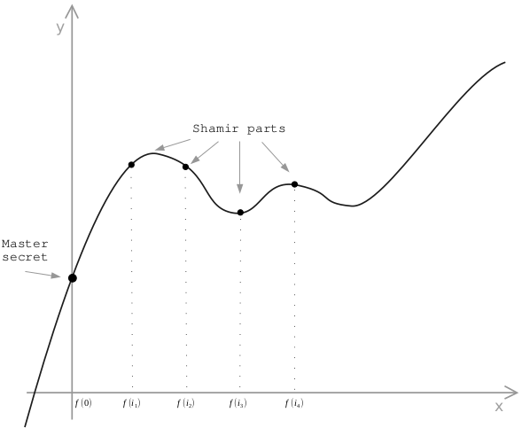
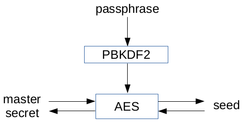

# SLIP-0039 : Shamir's Secret-Sharing for Mnemonic Codes

```
Number:  SLIP-0039
Title:   Shamir's Secret-Sharing for Mnemonic Codes
Type:    Standard
Status:  Draft
Authors: Pavol Rusnak <stick@satoshilabs.com>
         Ondrej Vejpustek <ondrej.vejpustek@satoshilabs.com>
         Tomas Susanka <tomas.susanka@satoshilabs.com>
         Marek Palatinus <slush@satoshilabs.com>
         Jochen Hoenicke <hoenicke@gmail.com>
Created: 2017-12-18
```

## Abstract

This SLIP describes a standard and interoperable implementation of Shamir's secret-sharing (SSS), which is a form of secret sharing, where a secret is divided into parts, giving each participant its own unique part, where some of the parts or all of them are needed in order to reconstruct the secret.

## Motivation

Preservation of digital assets is generally important and it is especially important in the case of decentralized payments systems such as Bitcoin, where there is no recourse in the case of loss of an asset. The usual approach to protecting digital assets is redundant backups, but when the asset itself is a valuable capability, there is a substantial risk of the backup holder absconding with the asset. Shamir's secret-sharing provides a better mechanism for replicating secrets without  giving the capability to the backup holder.

However, SSS is not standardized today, making it possible for a future secret recovery to be put in jeopardy if the tools have changed. Therefore, we propose standardizing SSS so that SLIP-0039 compatible implementations will be interoperable.

## Shamir's secret-sharing

Shamir's secret-sharing (SSS) is a cryptographic mechanism how to divide a secret into `N` unique parts, where `M` of them are required to reconstruct the secret. First, a polynomial of `N-1` degree is constructed and each party is given a corresponding point - a non-zero integer input to the polynomial and the corresponding output.

In case sufficient `M` values are provided the points exactly define the polynomial. The polynomial's value of `f(0) = S` corresponds to the master secret. You may read more on SSS on [Wikipedia](https://en.wikipedia.org/wiki/Shamir%27s_Secret_Sharing).



## Generating the mnemonic shares

The value to be encoded as the master secret must be a multiple of 8 bits. This is typically a wallet entropy, but may be another secret value which was uniformly chosen from its (key) space. The master secret is divided into `N` Shamir parts and `M` specifies how many of those parts do we need to reconstruct the master secret. We use `GF(256)` reduced by `x^8 + x^4 + x^3 + x + 1` (the Rijndael polynomial) as the underlying field.

We propose the following format of the shares:

| nonce (n) | index (I)  | threshold (M) | share (S)        | checksum (C) |
|-----------|------------|---------------|------------------|--------------|
| 20 bits   | 5 bits     | 5 bits        | 130/200/260 bits | 30 bits      |

* `nonce (n)` field is a random 20-bit identifier which is the same for all shares and it's used for detection whether the shares belong together, it's also later as salt in key derivation functions
* `index (I)` field corresponds to the SSS part's `x` value (see the diagram above)
* `threshold (M)` field indicates how many shares are needed to reconstruct the secret
* `index (I)` and `threshold (M)` fields values are from range 1-31, value 0 is not considered valid
* `share (S)` field is the corresponding SSS part's `y` value (see the diagram above) right-padded with zeroes to the nearest multiple of 10 bits
* `checksum (C)` field is a Bech32 checksum (defined in BIP-0173) of the whole share (that is `n || I || M || S`), human-readable part (hrp) of Bech32 is "SLIP0039"

This structure is then converted into a mnemonic code by splitting it up by 10 bits which correspond as an index to the a word list containing exactly 1024 words (see below).

| share length | total length           | security |
|--------------|------------------------|----------|
| 130 bits     | 190 bits = 19 words    | 128 bits |
| 200 bits     | 260 bits = 26 words    | 192 bits |
| 260 bits     | 320 bits = 32 words    | 256 bits |

Construction has the nice property that nonce transforms into exactly the first two words of the mnemonic code, so user can immediately tell whether the correct shares are being combined (they have to have the same first two words). Moreover the third word encodes exactly the index/threshold values, so for example share #2 of 3 required shares will always correspond to the same word.

## Converting the mnemonic shares to master secret

First, we check the checksum of each share and abort if they don't match. Implementations SHOULD NOT implement correction beyond potentially suggesting to the user where in the string an error might be found, without suggesting the correction to make.

If the checksum of each share is correct and enough `M` secrets are provided, we can produce the master secret from the shares.

## Passphrase

To allow an additional protection of the final seed using a passphrase we will use a key derivation function to compute the seed. If no passphrase is provided an empty string should be used as a passphrase.

Passphrase should contain only printable ASCII characters (codepoints 32-126) to achieve the best interoperability among various operating systems and wallet implementations.



We will use `PBKDF2(PRF = HMAC-SHA256, Password = master_secret, Salt = ("SLIP0039" || passphrase || n), iterations = 20000, dkLen = 256 bits)` as the key derivation function. Nonce value `n` is encoded as two words from the wordlist separated by exactly one space (codepoint 32).

We suggest to use the obtained seed as a master seed `S` for Hierarchical Deterministic Wallets described in BIP-0032.

## Versioning

Our scheme doesn't support versioning. This is intentional to avoid unclear claims such as SLIP-0039 compatibility without a clear understanding, which version of the scheme is actually meant.

## Localization

No localization is supported. This standard deals with a set of English words only. Previous attempts with arbitrary wordlists caused lots of confusion among users and decreased interoperability across various implementations.

## Wordlist

Wordlist mandated by this SLIP is [available here](slip-0039/wordlist.txt). Several criteria were applied where creating the list:

* wordlist is alphabetically sorted
* wordlist contains only common English words
* no word is shorter than 4 letters and longer than 8 letters
* all words have unique 4-letter prefix

## Test Vectors

TBD

## References

* [BIP-0032: Hierarchical Deterministic Wallets](https://github.com/bitcoin/bips/blob/master/bip-0032.mediawiki)
* [Secret Sharing Step by Step by Point Software](http://www.pointsoftware.ch/en/secret-sharing-step-by-step/)
* [BIP-0173: Base32 address format for native v0-16 witness outputs](https://github.com/bitcoin/bips/blob/master/bip-0173.mediawiki#Bech32)
