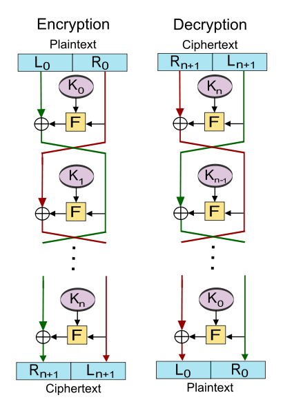

# SLIP-0039 : Shamir's Secret-Sharing for Mnemonic Codes

```
Number:  SLIP-0039
Title:   Shamir's Secret-Sharing for Mnemonic Codes
Type:    Standard
Status:  Draft
Authors: Pavol Rusnak <stick@satoshilabs.com>
         Ondrej Vejpustek <ondrej.vejpustek@satoshilabs.com>
         Tomas Susanka <tomas.susanka@satoshilabs.com>
         Marek Palatinus <slush@satoshilabs.com>
         Jochen Hoenicke <hoenicke@gmail.com>
         Andrew Kozlik <andrew.kozlik@satoshilabs.com>
Created: 2017-12-18
```

## Abstract

This SLIP describes a standard and interoperable implementation of Shamir's secret-sharing (SSS). SSS splits a secret into unique parts which can be distributed among participants, and requires a specified minimum number of parts to be supplied in order to reconstruct the original secret. Knowledge of fewer than the required number of parts does not leak information about the secret.

## Notation

Notation     | Meaning
-------------|------------------------------------------------------------------
*M*          | total number of shares, a positive integer, 1 &le; *M* &le; 32
*T*          | threshold value, a positive integer, 1 &le; *T* &le; *M*
*id*         | random identifier, a 30-bit positive integer
*s*          | share value, a string
*S*          | master secret, a string
*PMS*        | pre-master secret, a string
*PMD*        | pre-master digest, a string of four bytes
MSDF         | master secret derivation function
len(*x*)     | the length of the string *x* in bytes
&#124;&#124; | string concatenation operator
xor          | bit-wise exclusive-or of two strings
*x*[*i*:*j*] | the sub-array of the array *x* starting at position *i* and ending at position *j* &minus; 1.

## Motivation

Preservation of digital assets is generally important and it is especially important in the case of decentralized payments systems such as Bitcoin, where there is no recourse in the case of loss of an asset. The usual approach to protecting digital assets is redundant backups, but when the asset itself is of significant and liquidable value, there is a substantial risk of the backup holder absconding with the asset. Shamir's secret-sharing provides a better mechanism for replicating secrets, by distributing custodianship among a number of trusted parties in a manner that can prevent loss even if one or a few of those parties become compromised.

However, the lack of SSS standardization to date presents a risk of being unable to perform secret recovery in the future should the tooling change. Therefore, we propose standardizing SSS so that SLIP-0039 compatible implementations will be interoperable.

## Shamir's secret-sharing

Shamir's secret-sharing (SSS) is a cryptographic mechanism describing how to divide a secret into *N* unique parts, where any *T* of them are required to reconstruct the secret. First, a polynomial *f* of degree *N*&minus;1 is constructed and each party is given a corresponding point - a non-zero integer *x* input to the polynomial and the corresponding output *f*(*x*).

When any *T* points are provided, they exactly define the polynomial. The polynomial's value of *f*(0) = *PMS* is called the *pre-master secret*. More details on SSS can be found on [Wikipedia](https://en.wikipedia.org/wiki/Shamir%27s_Secret_Sharing).

We propose that the coefficients of *f* be generated randomly except for the constant coefficient which will encode the pre-master secret and the leading coefficient which will encode the hash of the pre-master secret. Encoding the hash makes it possible to verify that the pre-master secret has been correctly recovered.


## Generating the share mnemonic

The pre-master secret is divided into *N* Shamir parts and *T* specifies how many of those parts are needed to reconstruct the pre-master secret. Shamir's secret sharing scheme is applied separately to each byte of the pre-master secret and GF(256) is used as the underlying finite field<sup>[1](#FiniteField)</sup>. Bytes are interpreted as elements of GF(256) using polynomial representation with operations modulo the Rijndael irreducible polynomial *x*<sup>8</sup> + *x*<sup>4</sup> + *x*<sup>3</sup> + *x* + 1, see [AES](https://doi.org/10.6028/NIST.FIPS.197) sections 3.2, 4.1 and 4.4.

We propose the following format of the shares:

| Identifier (*id*) | Threshold (*t*) | Index (*I*) | Share value (*s*) | Checksum (*C*) |
|-------------------|-----------------|-------------|-------------------|----------------|
| 30 bits           | 5 bits          | 5 bits      | 8*n* bits         | 30 bits        |

* identifier (*id*) field is a random 30-bit value which is the same for all shares and used to verify that the shares belong together; it is also used as salt in key derivation functions.
* threshold (*t*) field<sup>[2](#IndexEncoding)</sup> indicates how many shares are needed to reconstruct the secret. The actual value is encoded as *t*=*T*&minus;1, so a value of 0 indicates that a single share is needed (*T*=1), a value of 1 indicates that two shares are needed (*T*=2) etc.
* index (*I*) field<sup>[2](#IndexEncoding)</sup> corresponds to the SSS part's *x* value, *x*=*I*+1, (see the diagram above).
* share value (*s*) field is the corresponding SSS part's *f*(*x*) values (see the diagram above), right-padded with "0" bits so that the length of the padded share value in bits becomes a multiple of ten.
* checksum (*C*) field is an RS1024 checksum (see below) of the data part of the share (that is *id* || *t* || *I* || *s*); the customization string (cs) of RS1024 is "slip0039"

This structure is then converted into a mnemonic code by splitting it up into 10 bit segments with each becoming an index to a word list containing exactly 1024 words (see below).

| Share value length | Total share length  | Security |
|--------------------|---------------------|----------|
| 130 bits           | 200 bits = 20 words | 128 bits |
| 260 bits           | 330 bits = 33 words | 256 bits |

This construction yields a beneficial property where the identifier transforms into exactly the first three words of the mnemonic code, so the user can immediately tell whether the correct shares are being combined (i.e. they have to have the same first two words). Moreover, the forth word encodes exactly the index/threshold values, so for example share #2 of 3 required shares will always correspond to the same word.

### Generating the share values

**Input:** master secret *S*, passphrase *P*, threshold *T*, number of shares *M*

**Output:** shares values *s*<sub>0</sub>, ... , *s*<sub>*M*&minus;1</sub>

1. Generate a random 30-bit value *id*.
2. Compute the pre-master secret *PMS* = MSDF<sup>-1</sup>(*S*, *P*, *id*, *T*).
3. Compute the *pre-master digest* (*PMD*) as the first four bytes of SHA-256(SHA-256(*PMS*)).
4. Let *a* be a *T*-by-len(*PMS*) array of bytes such that *a*[0] = *PMS*, *a*[*T*-1][0:4] = *PMD* and all remaining bytes are generated randomly and independently with uniform distribution.
5. The *j*-th byte of the share value *s<sub>i</sub>*, where 0 &le; *j* &lt; len(*PMS*) and 0 &le; *i* &lt; *M*, is computed in the field GF(256) as

    ![s_i[j] = \sum_{k=0}^{T-1} a[k][j] * (i+1)^k](slip-0039/evaluation.png)

## Checksum

The last three words of the mnemonic form a checksum and contain no information. Valid mnemonics MUST pass the criteria for validity specified by the Python3 code snippet below. The function `rs1024_verify_checksum` must return true when its arguments are:

- `cs`: the customization string
- `data`: the data part as a list of integers representing the words after conversion using the wordlist

```
def rs1024_polymod(values):
  GEN = [0xe0e040, 0x1c1c080, 0x3838100, 0x7070200, 0xe0e0009, 0x1c0c2412, 0x38086c24, 0x3090fc48, 0x21b1f890, 0x3f3f120]
  chk = 1
  for v in values:
    b = (chk >> 20)
    chk = (chk & 0xfffff) << 10 ^ v
    for i in range(10):
      chk ^= GEN[i] if ((b >> i) & 1) else 0
  return chk

def rs1024_verify_checksum(cs, data):
  return rs1024_polymod([ord(x) for x in cs] + data) == 1
```

This implements a Reed-Solomon code over GF(1024) that guarantees detection of any error affecting at most 3 words and has less than a 1 in 10<sup>9</sup> chance of failing to detect more errors. More details about the properties can be found in the Checksum Design appendix<sup>[3](#ChecksumDesign)</sup>. The customization string is processed by feeding each character's US-ASCII value into the checksum calculation prior to the data.

To construct a valid checksum given the customization string and the values of the data-part words, the code below can be used:

```
def rs1024_create_checksum(cs, data):
  values = [ord(x) for x in cs] + data
  polymod = rs1024_polymod(values + [0,0,0]) ^ 1
  return [(polymod >> 10 * (2 - i)) & 1023 for i in range(3)]
```

## Converting the mnemonic shares to the pre-master secret

Given *k* shares, the following checks are performed:

* Both the identifier and the threshold *T* are the same for all shares.
* The number of shares is at least *T*.
* The checksum of each share is valid. Implementations SHOULD NOT implement correction beyond potentially suggesting to the user where in the string an error might be found, without suggesting the correction to make.

Abort if any check fails; otherwise, the *m*-th byte of the pre-master secret *PMS* can be computed using Lagrange interpolation in the field GF(256) as

![\mathit{PMS}[m] = {\sum_{i=0}^{k-1}} s_i[m] {\prod_{\underset{j \neq i}{j=0}}^{k-1}} \frac{x_j}{x_j - x_i}](slip-0039/lagrange-pms.png).

The *m*-th byte, 0 &le; *m* &lt; 4, of the pre-master digest *PMD* can be computed as

![\mathit{PMD}[m] = {\sum_{i=0}^{k-1}} s_i[m] {\prod_{\underset{j \neq i}{j=0}}^{k-1}} \frac{1}{x_i - x_j}](slip-0039/lagrange-pmd.png).

Abort if the first four bytes of SHA-256(SHA-256(*PMS*)) are not equal to *PMD*.

## Passphrase

To allow additional protection of the master secret the pre-master secret is combined with a passphrase to derive the master secret. Several master secret derivation functions are proposed in the following section.

The passphrase should contain only printable ASCII characters (codepoints 32-126) to achieve the best interoperability among various operating systems and wallet implementations. If no passphrase is provided an empty string should be used as the passphrase.

The master secret can be used as the master seed *S* for Hierarchical Deterministic Wallets described in BIP-0032.

## Master secret derivation functions

Each of the master secret derivation functions uses the key derivation function PBKDF2<sup>[4](#KDFParam)</sup>. Whenever the random identifier value *id* or the threshold *T* is an input to PBKDF2, it is encoded in the following manner. The random identifier value is split into three 10-bit integers each encoded as two bytes in little-endian byte order. The threshold is encoded as one byte.

All of the proposed schemes are symmetric, i.e. they allow the creator of the shares to choose the master secret, which means that it is possible to to migrate a BIP-32 wallet from BIP-39 mnemonics to the new secret sharing scheme.

### Proposal 1: Feistel network

The master secret derivation function shall be a strong pseudorandom permutation (PRP)<sup>[5](#Security)</sup> based on the Luby-Rackoff construction. It shall consist of a four round Feistel network with PBKDF2 as the round function. The pre-master secret is first split into two equally long parts. `L` is the first *n*/2 bytes of the pre-master secret and `R` is the last *n*/2 bytes of the pre-master secret and processed as follows:

```
L = PMS[:len(PMS)/2]
R = PMS[len(PMS)/2:]
for i in range(4):
    (L, R) = (R, L xor F(i, R))
```

The master secret is then `R || L`.

The *i*-th round function `F(i, R)` is defined as follows:

```
F(i, R) = PBKDF2(PRF = HMAC-SHA256, Password = (passphrase || i), Salt = ("slip0039" || id || T || R), iterations = 5000, dkLen = n/2 bytes)
```

The value of *i* is encoded as one byte.



### Proposal 2: AES in CMC mode

AES in CMC mode shall be used as the master secret derivation function. The key derivation function PBKDF2 will be used to derive an AES symmetric key:

```
key = PBKDF2(PRF = HMAC-SHA256, Password = passphrase, Salt = ("slip0039" || id || T), iterations = 20000, dkLen = 256 bits)
```

The master secret is obtained by encrypting the pre-master secret using AES in CMC mode (CBC-mask-CBC) without a tweak as defined in [S. Halevi, P. Rogaway: A Tweakable Enciphering Mode](https://eprint.iacr.org/2003/148.pdf), paragraph "The CMC core". If the pre-master secret is 16 bytes long, then plain AES is used.

```
if len(PMS) == 16:
  S = AES.encrypt(mode=ECB, aeskey=key, PMS)
else:
  S = AES.encrypt(mode=CMC, aeskey=key, PMS)
```

### Proposal 3: AES in CTR mode

AES in CTR mode shall be used as the master secret derivation function. The key derivation function PBKDF2 will be used to derive an AES symmetric key and an initial counter value:

```
k = PBKDF2(PRF = HMAC-SHA256, Password = passphrase, Salt = ("slip0039" || id || T), iterations = 20000, dkLen = 512 bits)
iv = k[:16]   # first 16 bytes
key = k[32:]  # last 32 bytes
```

The master secret is the pre-master secret encrypted by AES in CTR mode:

```
S = AES.encrypt(mode=CTR, counter=iv, aeskey=key, PMS)
```

### Advantages and disadvantages

Each of the proposed derivation functions has its pros and cons, we tried to summarize the most important ones in the following table:

|                 | Security<sup>[5](#Security)</sup> | Master secret length restriction | Notes |
|----------------:|------------|----------------------|-----------------------------------|
| Feistel network | strong PRP | even number of bytes | looks like rolling our own crypto |
| AES in CMC mode | strong PRP | multiple of 16 bytes | highest implementation complexity |
| AES in CTR mode | not a PRP  | none                 |                                   |

## Versioning

Our scheme doesn't support versioning. This is intentional to avoid unclear claims such as SLIP-0039 compatibility without a clear understanding of which version of the scheme is actually meant.

## Localization

No localization is supported. This standard deals with a set of English words only. Previous attempts with arbitrary wordlists caused lots of confusion among users and decreased interoperability across various implementations.

## Wordlist

The wordlist mandated by this SLIP is [available here](slip-0039/wordlist.txt). Several criteria were applied in creation of the list:

* The wordlist is alphabetically sorted.
* No word is shorter than 4 letters.
* No word is longer than 8 letters.
* All words begin with a unique 4-letter prefix.
* The wordlist contains only common English words (+ the word "satoshi").
* The minimum Damerau-Levenshtein distance between any two words is at least 2.
* The similarity between the pronunciation of any two words has been minimized.

(see the [test](slip-0039/test_wordlist.sh) which checks whether these criteria are fulfilled).

## Test Vectors

TBD

## Design Rationale

1. <a name="FiniteField"></a>**Choice of finite field**

    Finite fields of the form GF(2<sup>*n*</sup>) and GF(*p*), where *p* is a prime number, were considered for this scheme. The field GF(256) was chosen, because the field arithmetic is easy to implement in any programming language and many implementations are already available since it is used in the AES cipher. The fact that it is byte oriented makes it easy to work with.

    Using a field of prime order GF(*p*), where log<sub>2</sub> *p* is approximately the length of the secret in bits, would require support for multi-precision arithmetic. Many programming languages, such as C/C++, do not support multi-precision arithmetic out of the box. Implementations would also need to store information about the prime number that should be used for each admissible length of the secret or they would need to compute the prime number on the fly.

    Choosing GF(2<sup>*n*</sup>), where *n* is the length of the secret in bits would require a more complicated implementation than GF(256). This is in part due to the multi-precision nature of the arithmetic and in part due to the fact that implementations would need to store an (e.g. lexicographically minimal) irreducible polynomial of degree *n* for each admissible value of *n* or they would need to be able to determine this polynomial on the fly.

2. <a name="IndexEncoding"></a>**Index encoding**

    It is anticipated that 32 shares will be more than enough for any application of Shamir's Secret Sharing Scheme to BIP-32 master seeds. Thus to reduce the mnemonic length, the Index and Threshold values are restricted to 5 bits each.

    The values in the Threshold and Index fields are interpreted in such a way that index 0 means *x*=1, index 1 means *x*=2 etc. If this convention was not applied and *x* would be exactly equal to the value in the index field, then 0 would have to be considered an invalid value. However, some implementations might fail to check this, which would open the door to the following attack: Assume that an implementation doesn't check that the supplied *x* value is non-zero. An attacker that has write access to one of the shares can then change the stored point from (*x*,*y*) to (0,*y*). If the implementation uses this value in the Lagrange interpolation formula, then the resulting pre-master secret will always be equal to *y* regardless of the values of the other shares. If this value is then used as a master seed for a BIP-32 wallet and the user transfers funds to this wallet, the attacker will be able to steal these funds because he knows *y*.

3. <a name="ChecksumDesign"></a>**Checksum design**

    The checksum design is heavily inspired by Bech32 defined in BIP-0173. The RS1024 checksum uses a Reed-Solomon code over GF(1024), so that the code alphabet matches the 10-bit wordlist. A Reed-Solomon code over GF(1024) allows creating mnemonics of length up to a thousand words, which is plenty. Shared secrets that would require such length are impractical for human entry and should be stored in binary form rather than mnemonic form. We picked 3 checksum words as a trade-off between the length of the mnemonics and the error-detection capabilities, as 3 checksum words is the lowest number sufficient for a random failure chance below 1 per billion. It is MDS code, which means that it is guaranteed to detect any 3 or fewer errors. This is the maximum possible for any kind of checksum that has length 3. Reed-Solomon codes can be viewed as a special case of BCH codes. In the Python3 code snippet we use the BCH view of Reed-Solomon codes, because it allows for a more efficient implementation of the algorithms. The generating polynomial of the code is (*x*&minus;*a*)(*x*&minus;*a*<sup>2</sup>)(*x*&minus;*a*<sup>3</sup>), where *a* is a root of the primitive polynomial *x*<sup>10</sup> + *x*<sup>3</sup> + 1 over GF(2). The elements of GF(1024) are represented as polynomials with operations modulo this primitive polynomial.

4. <a name="KDFParam"></a>**Choice of KDF function and parameters**

    PBKDF2 is a widely used standard password-based key derivation function. Newer key derivation functions such as scrypt or Argon2 were considered, but these require a large amount of memory, which is a limiting factor in hardware wallets.

    The SHA-256 algorithm operates on 32-bit words, whereas the SHA-512 algorithm operates on 64-bit words. As a consequence SHA-512 is significantly faster on 64-bit platforms than on 32-bit platforms, but SHA-256 performs almost the same on both platforms. Using HMAC-SHA-512 would put the user who may be running on a 32-bit platform at a significant disadvantage against an attacker which is running a brute force attack on a 64-bit platform. This is why HMAC-SHA-256 was chosen as the pseudorandom function for PBKDF2. If the length of the master secret is limited to a maximum of 256 bits, then using HMAC-SHA-256 instead of HMAC-SHA-512 presents no weakness.

    The number of iterations in PBKDF2 was chosen to be 20000. In case of the Feistel-based derivation function, the number of iterations is 5000, since PBKDF2 is called four times. A larger number of iterations in PBKDF2 would impact the user experience in hardware wallets.

5. <a name="Security"></a>**Security**

    The advantage of a pseudorandom function (PRF) or a strong pseudorandom permutation (PRP) over a simple encryption scheme is that it thwarts attacks where the adversary obtains, for example, the first several bytes of *T* different shares. If the master secret were not protected by a pseudorandom permutation, the adversary could compute a part of the master secret. This is a serious concern if the master secret is, for example, a private key. Protecting the master secret using AES in any of the common block cipher modes does not solve this problem.

    It might appear that such attacks would not be possible had a lager finite field been used, such as GF(2<sup>*n*</sup>) or GF(*p*), where *n*&asymp;log<sub>2</sub> *p* and *n* is the length of the secret in bits. However, we are not aware of any proof that Shamir's secret sharing scheme is secure in scenarios where partial information about the shares is leaked. In fact, our preliminary investigation indicates that in certain cases information about the pre-master secret may leak if partial knowledge of *T* shares is available. Thus the use of a strong pseudorandom permutation is advisable regardless of the choice of the field.

    The role of the key derivation function in the Feistel-based derivation function is twofold. Firstly, it protects the passphrase against brute-force and dictionary attacks. Secondly, if the adversary obtains a part of the pre-master secret as described above, the slow key derivation function protects against brute-force attacks which attempt to reveal the unknown part of the pre-master secret.

6. <a name="PassphraseVerification"></a>**Passphrase verification**

    The proposed design does not provide a way to verify that the correct passphrase was used to derive the master secret. This is an intentional feature which allows the user to derive multiple master secrets from a single pre-master secret by using different passphrases. This design allows for plausible deniability when the master secret is used as the master seed for a hierarchical deterministic wallet (see BIP-32). Every passphrase generates a valid seed but only the correct one will make the desired wallet available. Thus the owner can use one passphrase to access their real wallet and another passphrase to access a decoy wallet. If the owner is later coerced into revealing their passphrase either by [law](https://en.wikipedia.org/wiki/Key_disclosure_law) or by force, then they can reveal the passphrase which accesses the decoy wallet and [plausibly deny](https://en.wikipedia.org/wiki/Plausible_deniability) the existence of their real wallet, because there is no way for the coercer to prove that the decoy wallet is not the real one.

## References

* [BIP-0032: Hierarchical Deterministic Wallets](https://github.com/bitcoin/bips/blob/master/bip-0032.mediawiki)
* [Secret Sharing Step by Step by Point Software](http://www.pointsoftware.ch/en/secret-sharing-step-by-step/)
* [FIPS-197: Specification for the Advanced Encryption Standard (AES)](https://doi.org/10.6028/NIST.FIPS.197)
