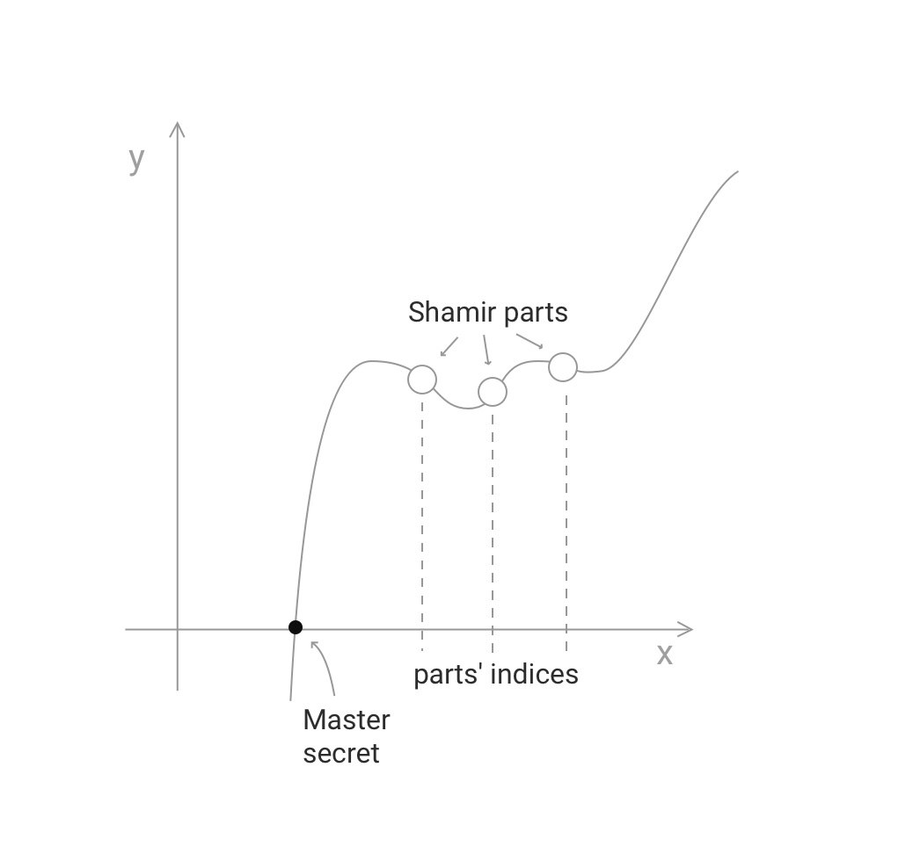
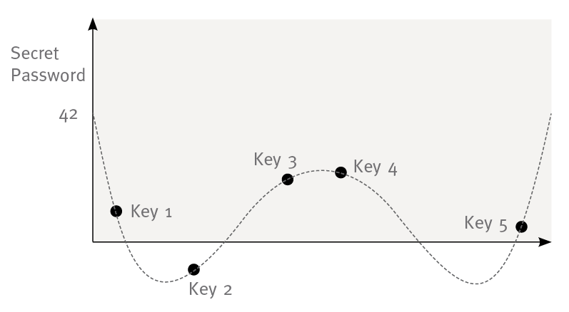

# SLIP-0039 : Shamir's Secret-Sharing Scheme for Mnemonic Codes

```
Number:  SLIP-0039
Title:   Shamir's Secret-Sharing Scheme for Mnemonic Codes
Type:    Standard
Status:  Draft
Authors: Pavol Rusnak <stick@satoshilabs.com>
         Tomas Susanka <tomas.susanka@satoshilabs.com>
         Ondrej Vejpustek <ondrej.vejpustek@satoshilabs.com>
         Marek Palatinus <slush@satoshilabs.com>
         Jochen Hoenicke <hoenicke@gmail.com>
Created: 2017-12-18
```

## Abstract

This SLIP describes a standard and interoperable implementation of Shamir's secret-sharing scheme (SSSS), which is a form of secret sharing, where a secret is divided into parts, giving each participant its own unique part, where some of the parts or all of them are needed in order to reconstruct the secret.

## Motivation

Preservation of digital assets is generally important and it is especially important in the case of decentralized payments systems such as Bitcoin, where there is no recourse in the case of loss of an asset. The usual approach to protecting digital assets is redundant backups, but when the asset itself is a valuable capability, there is a substantial risk of the backup holder absconding with the asset. Shamir's secret-sharing scheme provides a better mechanism for replicating secrets without  giving the capability to the backup holder.

However, SSSS is not standardized today, making it possible for a future secret recovery to be put in jeopardy if the tools have changed. Therefore, we propose standardizing SSSS so that SLIP-0039 compatible implementations will be interoperable.

## Shamir's secret-sharing scheme

Shamir's secret-sharing scheme (SSSS) is a cryptographic mechanism how to divide a secret into N unique parts, where M of them are required to reconstruct the secret. First, a polynomial of N-1 degree is constructed and each party is given a corresponding point - a non-zero integer input to the polynomial and the corresponding output.

In case sufficient M values are provided the points exactly define the polynomial. The polynomial's value of f(x) = 0 corresponds to the master secret. You may read more on SSSS on [Wikipedia](https://en.wikipedia.org/wiki/Shamir%27s_Secret_Sharing).

TODO mention fields?



## From entropy to mnemonic secrets

The value to be encoded as the master secret must be a multiple of 16 bits. This is typically a wallet entropy, but we do not restrict the usage in any way. The master secret is divided into N Shamir parts and M specifies how many of those parts do we need to reconstruct the master secret. We use GF(2^16) as the underlying field. We consider the master secret in a form which includes its own checksum:

| master secret | 16-bit master secret checksum |

From this value the N parts are generated and each participating party receives the following data:

| 00 | 4-bit index | 4-bit M threshold | variable-bit SSSS part | 16-bit checksum |

The index corresponds to the SSSS part's x value (see the diagram above) and the SSSS part is the corresponding y value. Finally, the checksum field is a checksum of both the whole share (including padding zeroes, index and threshold, N is not included).

This structure is then converted into a mnemonic passphrase by splitting it up by 10 bits which correspond as an index to the a word list containing exactly 1024 words (see below).

| master secret | SSSS part | share length           |
|---------------|-----------|------------------------|
| 128 bits      | 144 bits  | 170 bits = 17 words    |
| 256 bits      | 272 bits  | 298 bits = 30 words    |

## Checksum

For checksum we use lower 16-bits of CRC32 algorithm. We don't use CRC16, because there are lots of different standards and CRC32 has much higher chance to be implemented in the standard library of your choice. Also we won't need 32-bit resolution and this would lead to more words in the shares.

## Passphrase

When enough M secrets are provided the master secret is reconstructed. To allow an additional protection of the final seed using a passphrase we suggest a following scenario. The passphrase is hashed using PBKDF2, which servers as a key to an AES encryption. The result of this encryption is the final seed to be used. If no passphrase is provided the passphrase is set to an empty string.



This mechanism is intentionally symmetric to allow reconstructing the master secret from the seed in case the passphrase is known.

TODO: We propose to use (X) rounds of PBKDF2 and (Y) rounds of AES (which mode?).

## Versioning

Our scheme doesn't support versioning. This is intentional to avoid unclear claims such as SLIP-0039 compatibility without a clear understanding, which version of the scheme is actually meant. We encourage creating a new document for any new improvements. Since the master secret is easily retrievable, migration to a new scheme is trivial.

## Localization

No localization is supported. This standard deals with a set of English words only.

## Wordlist

Wordlist mandated by this SLIP is . Several criteria were applied where creating the list:

* wordlist is alphabetically sorted
* wordlist contains only common English words
* no word is shorter than 4 letters and longer than 8 letters
* all words have unique 4-letter prefix

## References

* [Secret Sharing Step by Step by Point Software](http://www.pointsoftware.ch/en/secret-sharing-step-by-step/)
